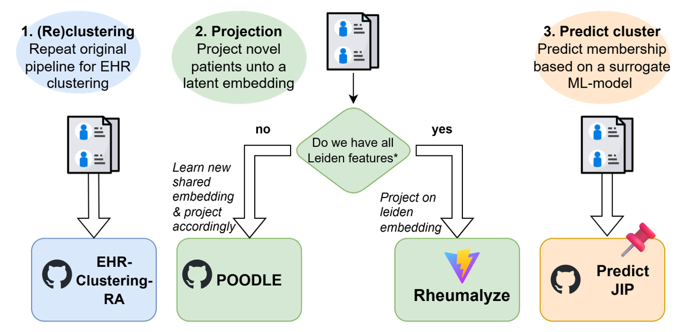

# PredictJIP
To facilitate the use of Joint Involvement Patterns (JIPs) in research, we developed surrogate models to detect them using only a few clinical features.

## Background
JIPs stratify rheumatoid arthritis patients into four phenotypes based on affected joint distribution: JIP-foot (predominantly foot involvement), JIP-oligo (few affected joints), JIP-hand (predominantly hand involvement), and JIP-poly (many affected joints). These patterns correspond to differences in treatment outcomes and synovial histology. For more information on the clinical relevance of JIPs, see our study: https://www.nature.com/articles/s41746-025-01997-1 

We built two probabilistic models, each designed around the types of joint assessments that centers most commonly collect. These models output class probabilities, enabling users to choose decision thresholds that best fit their desired balance of precision, sensitivity, or overall accuracy. However, note that applying a very stringent cut-off may result in patients not being assigned to any cluster at all.

The three models—each validated on a hold-out set—are based on the following joint schemes (and ACPA, RF, Age & Sex):
- DAS44 
- DAS66/68 (ideal)
- DAS28 (suboptimal for JIP-foot)

We also have a model for DAS28 joint scheme, but since the Foot joints are not measured here. It is not preferred.

## Overview of JIP-related Github Repo's

### Different ways to detect the JIPs
In order to identify JIPs, you have three options: 
1. (Re)clustering : run entire cluster analysis again, see our original clustering pipeline [EHR-clustering](https://github.com/levrex/EHR-Clustering-RA)
2. Projection : project patients on latent space [POODLE](https://github.com/levrex/Poodle) or use our client-based webtool [Rheumalyze](https://knevel-lab.github.io/Rheumalyze/)
3. Prediction : use a surrogate technique to predict the JIP cluster (This github repo!)

## Directory Structure
* `README.md`: This file
* `Manual_How to detect JIPs_v1.pdf`: User manual with extra information on the different models (input, performance, etc...)
* `requirements.txt`: Prerequisite python modules (with version numbers) to run code
* `figures/md`: Figures used for the readme
* `figures/das28`: Figures for the DAS28 model (i.e. SHAP feature importance plot)
* `figures/das44`: Figures for the DAS44 model (i.e. SHAP feature importance plot)
* `figures/das66`: Figures for the DAS66 model (i.e. SHAP feature importance plot)
* `models/*`: Contains the final models for predicting the JIP
  * `models/das28/JIP_xgb_pred_28.pk` : Pickle object containing DAS28 model (also needs age, sex, acpa & rf)
  * `models/das44/JIP_xgb_pred_44.pk` : Pickle object containing DAS44 model (also needs age, sex, acpa & rf)
  * `models/das66/JIP_xgb_pred_66.pk` : Pickle object containing DAS66 model (also needs age, sex, hb, leukocytes, trombocytes, acpa & rf)
* `src/*`: Important functions for feature engineering
  * `src/DAS28_joints.py`: Contains lists of DAS28 joints for each anatomical location (based on Leiden EHR naming convention) 
  * `src/DAS44_joints.py`: Contains lists of DAS44 joints for each anatomical location (based on Leiden EHR naming convention)
  * `src/DAS66_joints.py`: Contains lists of DAS66 joints for each anatomical location (based on Leiden EHR naming convention) 
* `notebooks/*`: Example notebooks showing how to run the code
  * `notebooks/Example_notebook_das28.ipynb`: How to run DAS28 model (or retrain)
  * `notebooks/Example_notebook_das44.ipynb`: How to run DAS44 model (or retrain)
  * `notebooks/Example_notebook_das66.ipynb`: How to run DAS66 model (or retrain)
  * `notebooks/Example_KAN_encoder_optimization.ipynb`: How to train the ensemble KAN-encoder

## Contact
If you experience difficulties with implementing the pipeline or if you have any other questions feel free to send me an e-mail. You can contact me on: t.d.maarseveen@lumc.nl 
